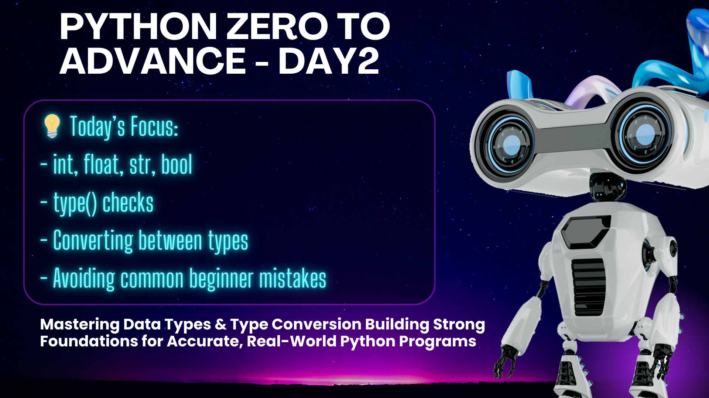

# Day 2 – Python Core: Data Types & Type Conversion

---

## 🔹 Class Focus Today

In Day 2, we focused on **Python Data Types** and **Type Conversion**:

- `int` → Whole numbers  
- `float` → Decimal numbers  
- `str` → Text / strings  
- `bool` → True / False  
- Using `type()` to check variable type  
- Converting between types using `int()`, `float()`, `str()`

---

## 🔹 Why This Matters

Understanding **data types** is the foundation of programming.  
If you use the wrong type in calculations or print statements, Python will throw errors.  
Correct type management ensures your code runs **smoothly and accurately**.

---

## 🔹 Common Mistakes Beginners Make

1. Forgetting that `input()` **always returns a string**  
2. Trying to perform arithmetic on strings without conversion  
   - Wrong: `"10" + 5` → Error  
   - Correct: `int("10") + 5` → 15  
3. Forgetting to convert number → string when combining with text in `print()`  
   - Wrong: `"You are " + 20 + " years old"` → Error  
   - Correct: `"You are " + str(20) + " years old"`  

---

## 🔹 Real-Life Applications

- Reading user data in apps, forms, or websites  
- Performing calculations from user input  
- Processing data for backend systems  
- Logging and reporting user information correctly  

---

## 🔹 Programs Covered Today

1. **Data Types Exploration** – `01_data_types.py`  
2. **Type Conversion Practice** – `02_type_conversion.py`

---

## 🔹 Tips

- Always **check variable type** with `type()` before doing calculations  
- Practice **converting types** often – it’s a common source of beginner mistakes  
- Think in **input → process → output** way

---

**Next Class (Day 3):** Control Flow – `if-else` and `loops`  
