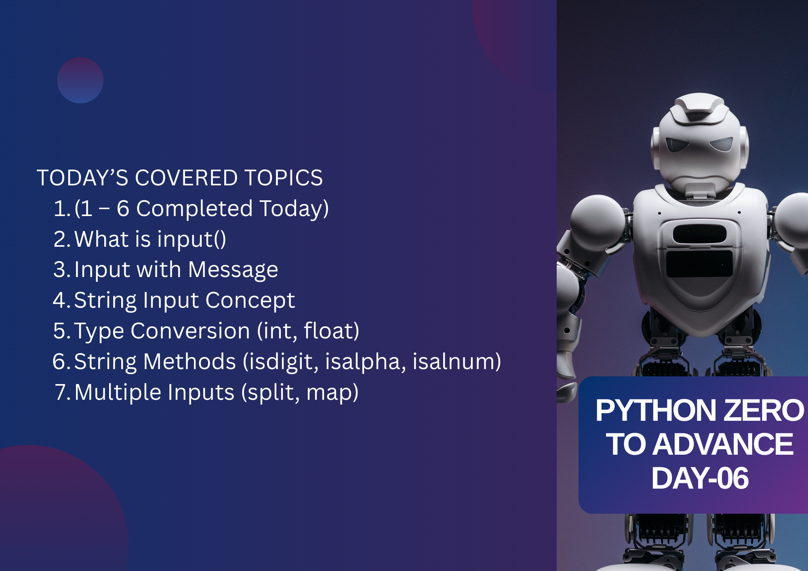

# Day 6 – Python `input()` Fundamentals (Topics 1–6)

Welcome to **Day 6** of my **Python Zero to Advanced Journey**.  
Today’s class focused on the **fundamental concepts of Python `input()`**, covering how user input is taken, how it is stored, and how it is processed safely in real programs.  
Since almost every interactive application depends on user input, this topic is a core foundation of Python programming.

---

## 📌 Topics Covered Today

Today we covered **Topics 1 to 6** of Python `input()`:

- What `input()` is and how it works  
- Using messages with `input()` for better user interaction  
- Understanding that `input()` always returns a **string**  
- Converting input data using `int()` and `float()`  
- Validating input using string methods like `isdigit()`, `isalpha()`, and `isalnum()`  
- Taking multiple inputs in one line using `split()` and `map()`  

---

## 🧠 Practice & Examples

During the class, we practiced multiple small programs that demonstrated:
- Taking user name and age as input  
- Converting string input into numeric values for calculations  
- Preventing errors by validating input before conversion  
- Accepting multiple numbers in a single line and processing them correctly  

These examples helped connect theory with real-world usage.

---

## 🎯 Learning Outcome

By the end of today’s class:
- I clearly understood how Python handles user input  
- I learned why type conversion is required after `input()`  
- I practiced safe input handling using validation methods  
- I gained confidence in working with single and multiple inputs  

This class built a strong base for writing interactive and error-free Python programs.

---

## 🚀 Next Class Plan

In the next session, we will complete **Topics 7–11**:
- `input()` with loops  
- `input()` with lists  
- `input()` with dictionaries  
- Input validation patterns  
- Error handling using `try / except`  

---

## 🔗 Author

**Agrojit**  
Python Learner | Daily Progress | Zero to Advanced
